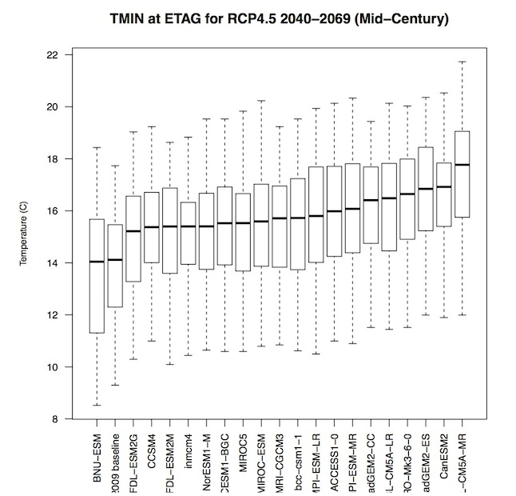
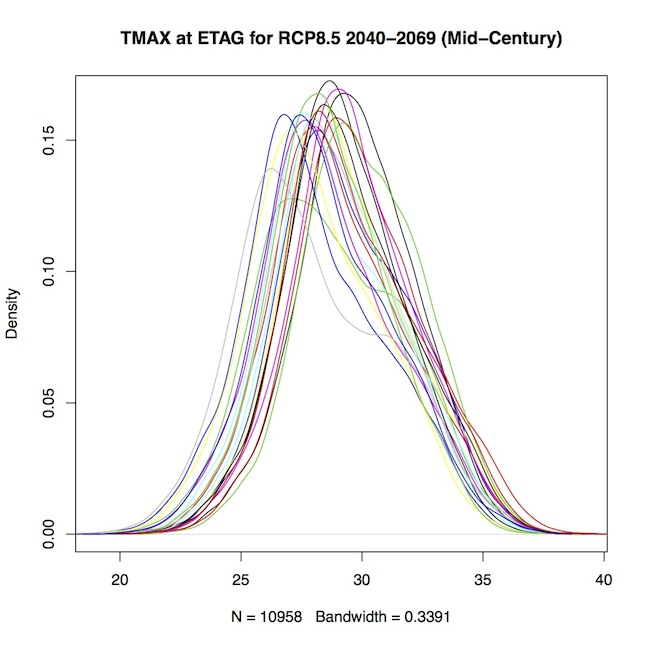

plotclim
========

AgMIP climate data visualization scripts (in R)
- - - 
By [Ioannis N. Athanasiadis](http://www.athanasiadis.info), [Democritus University of Thrace](http://eco.logismi.co)   
Last updated September 15, 2013  
Version: 0.9 ("Uganda")   

This software is distributed under the GPL licence (GPL>v3)

- - - 

This collection of scripts aim to help AgMIP climate team to generate some common visualizations for their reports.

##To generate box plots

1. Load the main script file

 		source("plotclim.R")
 	
- Change directory where your AgMIP files are. ie:

 		setwd("/Users/ioannis/sample");
-  Generate box plots diagrams by passing three arguments 
	a. Station name 4-letter code (i.e.`ETAG`)
	- Climate scenarios one-lettered code (i.e `I`). Consult the AgMIP notation for climate files.
	- Climate variables (one of `TMAX`,`TMIN`,`RAIN`).   
	*Example*:
	
			saveBoxPlots("ETAG",c("G","I","K","M"),c("TMAX","TMIN","RAIN"));
	
	Output is stored in the working folder always with the same name: "ETAG_boxplots.pdf".
	Consequetive runs will overwrite the file.

	

##To generate probability density function plots	    
Follow the same steps as before with the `savePDFs` script. Example:    
	    
	savePDFs("ETAG",c("G","I","K","M"),c("TMAX","TMIN","RAIN"));      

